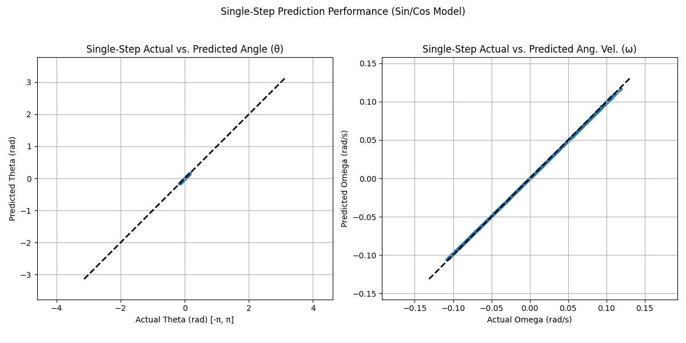
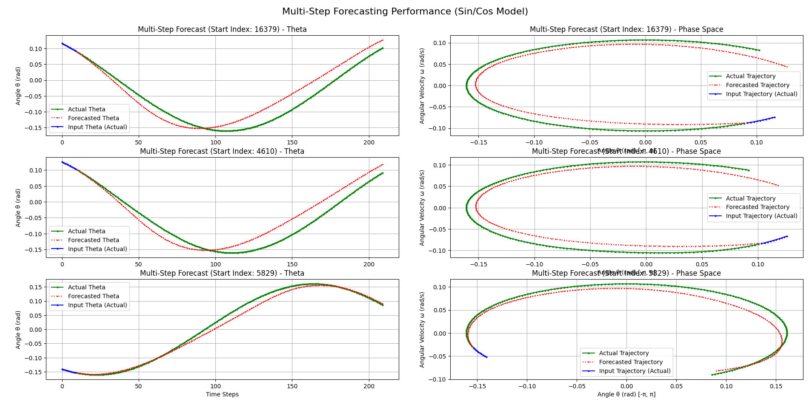

# Physics Simulation Analysis: Driven Pendulum Forecasting with LSTM

## Project Goal

This project simulates the dynamics of a driven damped pendulum and utilizes a Long Short-Term Memory (LSTM) neural network to predict its future state (angle and angular velocity). A key aspect is the successful handling of the angle's periodicity using `sin` and `cos` transformations for robust machine learning.

## Key Features

*   **Physics Simulation:** Accurate simulation of the driven damped pendulum using `scipy.integrate.solve_ivp`.
*   **Data Generation:** Creates diverse training data by running simulations with varied initial conditions.
*   **Periodicity Handling:** Employs `sin(theta)` and `cos(theta)` features to effectively represent the pendulum's angle for the ML model, avoiding issues with angle wrapping.
*   **LSTM Model:** Implements an LSTM network using TensorFlow/Keras for sequence prediction.
*   **High Accuracy:** Achieves excellent single-step prediction accuracy for both angle and angular velocity.
*   **Dynamic Forecasting:** Demonstrates the model's ability to capture the system's underlying dynamics (limit cycle attractor) in multi-step forecasting, despite expected long-term phase drift.

## Tech Stack

*   Python 3.x
*   NumPy
*   SciPy
*   Pandas
*   TensorFlow / Keras
*   Scikit-learn
*   Matplotlib
*   Joblib

## Project Structure & Scripts

1.  **`simulate_pendulum.py`**:
    *   Defines the pendulum's ordinary differential equations (ODEs).
    *   Runs multiple simulations using `scipy.integrate.solve_ivp` with varying initial conditions (`theta_init`, `omega_init`).
    *   Saves the raw time series data (`time`, `theta`, `omega`, `run_id`) for all runs into `pendulum_data/combined_pendulum_data.csv`.

2.  **`process_data.py`**:
    *   Loads the raw simulation data from the CSV.
    *   Calculates `sin(theta)` and `cos(theta)` features.
    *   Creates input sequences (shape: `(sequence_length, 3)`) using `[sin(theta), cos(theta), omega]` from previous time steps.
    *   Creates corresponding target outputs (shape: `(3,)`) representing the *next* state `[sin(theta_next), cos(theta_next), omega_next]`.
    *   Splits the data into training, validation, and test sets, ensuring sequences from the same simulation run (`run_id`) stay within the same set.
    *   Applies `StandardScaler` (fitted on training data only) to scale both input features and target outputs.
    *   Saves the scaled data arrays (`.npy`) and the fitted scalers (`.pkl`) to the `processed_data_sincos/` directory.

3.  **`train_model.py`**:
    *   Loads the preprocessed and scaled training and validation data.
    *   Defines the LSTM model architecture using Keras (LSTM layer, Dropout, Dense output layer with 3 units).
    *   Compiles the model (Adam optimizer, MSE loss).
    *   Sets up callbacks (`ModelCheckpoint` to save the best model based on `val_loss`, `EarlyStopping` to prevent overfitting).
    *   Trains the model on the training data, validating against the validation data.
    *   Saves the best trained model to `trained_model_sincos/best_lstm_model_sincos.keras`.
    *   Plots the training and validation loss/MAE history.

4.  **`evaluate`**:
    *   Loads the best trained model (`.keras`) and the scaled test data/scalers.
    *   Evaluates single-step prediction performance on the test set.
    *   Inverse transforms the scaled predictions and actual values (`[sin, cos, omega]`).
    *   Reconstructs the angle `theta` using `np.arctan2(sin, cos)`.
    *   Calculates and prints final evaluation metrics (MSE, MAE) on the *reconstructed* `theta` and `omega`.
    *   Generates single-step prediction performance plots (scatter plots: actual vs. predicted `theta`/`omega`).
    *   Performs multi-step forecasting: recursively predicts future steps using the model's previous output as input.
    *   Generates multi-step forecast plots comparing the predicted trajectory against the actual trajectory (theta vs. time and phase space).

## Results

The model demonstrates high accuracy in predicting the pendulum's state one step ahead, effectively overcoming the angle periodicity challenge.

**Single-Step Prediction:**
The scatter plots show excellent agreement between the actual and predicted values for both the reconstructed angle (`theta`) and angular velocity (`omega`).
*   Theta MAE: ~0.00063 rad (~0.036 deg)
*   Omega MAE: ~0.00096 rad/s



**Multi-Step Forecasting:**
When forecasting multiple steps ahead recursively, the model successfully captures the overall dynamics and shape of the system's limit cycle attractor in phase space. While small errors accumulate leading to a phase drift over long horizons (expected behavior), the prediction remains stable and qualitatively correct.



## Setup & Installation

1.  **Clone the repository:**
    ```bash
    git clone <your-repo-url>
    cd <your-repo-name>
    ```
2.  **Create a virtual environment (recommended):**
    ```bash
    python -m venv venv
    source venv/bin/activate  # On Windows use `venv\Scripts\activate`
    ```
3.  **Install dependencies:**
    ```bash
    pip install -r requirements.txt
    ```

## Usage

Run the scripts in the following order:

1.  **Generate Simulation Data:**
    ```bash
    python simulate.py
    ```
    (This creates `pendulum_data/combined_pendulum_data.csv`)

2.  **Preprocess Data:**
    ```bash
    python preprocess_sincos.py
    ```
    (This creates the `processed_data_sincos/` directory with `.npy` and `.pkl` files)

3.  **Train the Model:**
    ```bash
    python train_sincos.py
    ```
    (This creates the `trained_model_sincos/` directory with the `.keras` model file)

4.  **Evaluate and Visualize:**
    ```bash
    python evaluate_sincos.py
    ```
    (This prints evaluation metrics and displays the result plots)